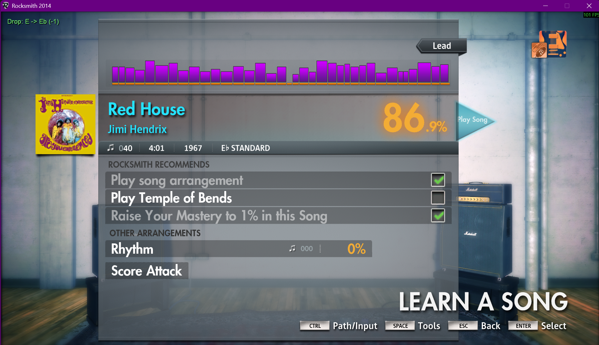
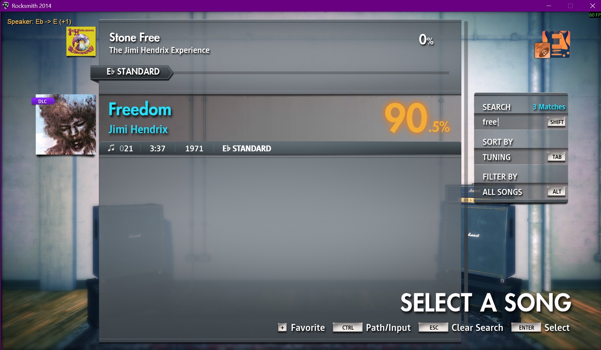

# RSModsPlus

<a href="https://buymeacoffee.com/cheesewizard">
  
</a>
<br><br>

A fork of [RSMods](https://github.com/Lovrom8/RSMods) that adds pitch routing
to Rocksmith 2014: a **Drop Pedal** that shifts the guitar to the song, and a
**Speaker Mode** that shifts the song to the guitar.

`F7` cycles between the two modes and Off. Range is -24 to +24 semitones.
Supported game versions: Rocksmith 2014 Remastered (September 2022 update),
fully playable including multiplayer, and the Learn & Play (December 2024)
update, supported with partial multiplayer functionality currently.

https://github.com/user-attachments/assets/c8951c94-e760-4830-a8f5-6b383dbb05da

## Quick start

1. Make sure this is in `RSMods.ini` next to `Rocksmith2014.exe`:

   ```ini
   [Drop Pedal]
   EnableDropPedal = on
   Engine = automatic
   ```

2. Start Rocksmith and press `F7` once. The top-left readout changes from
   `Pitch: Off` to `Drop: E`.

3. Match the readout to the song. Press `,` to move down one semitone or `.`
   to move up one semitone. For example, with a guitar in E standard and an Eb
   song, press `,` once until the readout says `Drop: E -> Eb (-1)`.

Other controls:

| Action | Player 1 | Player 2 |
|---|---|---|
| Cycle Drop Pedal / Speaker Mode / Off for everyone | `F7` | - |
| Move the target down / up | `,` / `.` | `Control+,` / `Control+.` |
| Tell the mod the guitar's physical tuning | `F9` | `Control+F9` |

Settings are read when the game starts, and every session starts at
`Pitch: Off`. If the keys do nothing or the mod seems missing, the
[Quick Start guide](docs/quick-start.md) walks through the install gotchas
and the extra controls.

---

## Drop Pedal

Shifts the **guitar** so a song in any uniform tuning can be played without
touching a tuning peg. To play an Eb song on an E-standard guitar, set the
pedal to -1. Audio and note detection move together, so the tuner and scoring
follow the shift.



Two engines realise the shift, selected at launch and announced on screen:

- **ASIO engine**: with [RS_ASIO](https://github.com/mdias/rs_asio), the raw
  input is shifted before Rocksmith receives it. No tone setup: every tone,
  stock or custom, receives the shifted signal.
- **Cable engine**: without RS_ASIO, such as a plain Real Tone cable, the
  shift is applied through a MultiPitch pedal in the tone and the game's
  tuning reference is transposed to match.

Multiplayer is supported by both engines: each player has an independent
target and base tuning (`Control` + the pedal keys addresses Player 2), with
`[Asio.Input.0]` as Player 1 and `[Asio.Input.1]` as Player 2 under ASIO.


**Setup and usage:** the **[ASIO Drop Pedal guide](docs/asio-drop-pedal.md)**
for RS_ASIO interfaces, or the
**[Cable Drop Pedal guide](docs/cable-drop-pedal.md)** for Real Tone cable
setups.

---

## Speaker Mode

Shifts the **song** instead of the guitar. Intended for playing through
speakers, where the acoustic guitar is audible in the room: the music comes to
your tuning, and the guitar stays physically untouched.



- Requires no RS_ASIO, no audio interface, and no MultiPitch tone; a Real
  Tone cable alone is enough.
- Gameplay audio carries **zero added latency**: the full song is
  pitch-rendered ahead of playback into temporary audio and read by exact song
  position.
- The chart tuning is read automatically at the pre-song tuner, and **any
  chart shape works**: uniform, drop and open tunings. For non-uniform
  shapes, the tuner guides the physical retune string by string (a Drop Db
  chart with an E-standard guitar asks for one string down to D, then raises
  the song a semitone: `Speaker: Eb Drop Db -> Drop D (+1)`).
- Prepared audio is session-temporary and deleted on close; nothing persists
  between launches.

**Setup and usage:** the **[Speaker Mode guide](docs/speaker-mode.md)**.

---

## What this fork adds

- The Drop Pedal, -24 to +24 semitones, with ASIO and Cable engines and full
  multiplayer support: independent per-player targets, base tunings and
  overlay rows.
- Speaker Mode, temporary full-song pitch rendering with zero added gameplay
  latency and automatic chart synchronization for any tuning shape.
- A base tuning setting, so shifts are named from whatever the guitar is
  physically in rather than from E.
- An on-screen readout of the current mode, route and per-player state, plus
  settings and rebindable keys in the settings app (Tuning tab).

Everything else comes from RSMods 1.2.8.2 and behaves as upstream documents
it: extended range mode, custom song list titles, toggle loft, force
re-enumeration, GuitarSpeak, and the rest. See
[upstream's README](https://github.com/Lovrom8/RSMods#readme) for that list
and for the full `RSMods.ini` reference.

---

## Installing

This is built from RSMods 1.2.8.2 and uses the same filename, so it replaces
RSMods' own `xinput1_3.dll` rather than sitting beside it. Only one of the two
can be loaded at a time.

**If you already have RSMods installed, back up the existing `xinput1_3.dll`
first.** Copy it somewhere outside the game folder, or rename it. That copy is
how you get back to plain RSMods later.

Then download `xinput1_3.dll` from the
[latest release](https://github.com/Cheesewizard/RSModsPlus/releases) and put
it in your Rocksmith 2014 folder, next to `Rocksmith2014.exe`, overwriting the
file that is already there.

Your `RSMods` folder, the settings app and `RSMods.ini` are untouched and
carry on working. Speaker Mode additionally requires the matching `RSMods`
folder from the same release, because its helper and decode tools prepare the
temporary full-song audio.

To uninstall, put your backup back. If you had no RSMods before this, deleting
the file is enough.

Requirements are upstream's: Steam Rocksmith 2014 Remastered on Windows, and
the MS Visual C++ 2015-2019 redistributable. The ASIO engine additionally
needs [RS_ASIO](https://github.com/mdias/rs_asio) and an ASIO audio interface;
the Cable engine and Speaker Mode need neither.

---

## How it works

**ASIO Drop Pedal.** With RS_ASIO installed, the mod hooks the ASIO driver
below RS_ASIO and gives each configured Rocksmith input its own persistent
pitch shifter, so note detection, the tuner and tone processing all consume
the same shifted signal. The shifter uses period-synchronous splicing.
At 48 kHz with 128-frame callbacks, the production-shifter harness measures
roughly 6-20 ms of observable content delay depending on the note and shift.
This is added to the interface's normal round-trip latency. For comparison,
DigiTech does not publish a latency specification for its well-regarded Drop
pedal, but independent waveform tests report roughly
[12-17 ms](https://www.thefretboard.co.uk/discussion/107282/digitech-drop-tune/p2),
including a detailed burst test measuring about
[16 ms](https://www.reddit.com/r/audioengineering/comments/r3mecr/analyzing_the_digitech_drop_pedal/). The methods are not identical,
but they put this mod's measured delay in the same broad range as dedicated
hardware. End-to-end feel also depends on the interface's round trip, so a low
ASIO buffer remains important. Input formats `Float32`, `Int32`, `Int24` and
`Int16` and buffer sizes from 1 to 4096 frames are accepted, so common
interfaces work out of the box.

**Cable Drop Pedal.** Without RS_ASIO, detection reads the raw signal upstream
of the tone chain, so the mod shifts inside the game instead: it retunes a
MultiPitch pedal in the player's tone and transposes the reference frequency
the game derives its expected pitch from. In multiplayer, each tone's pitch
pedal and each player's detection reference are attributed to their owning
player. This engine needs the MultiPitch pedal in the tone and covers uniform
tunings.

**Speaker Mode.** The mod hooks the game's Wwise music decoding. Menu previews
are shifted live; for gameplay, the selected song is decoded and pitch-rendered
in full into a temporary delete-on-close file, which playback reads by exact
song position, with zero added latency and no change to the song's duration. The
chart tuning is synchronized automatically, the game's tuning reference is
adjusted so the chart is playable in the physical tuning, and any preparation
failure turns the mode off rather than play at a wrong pitch.

---

## Documentation

| Document | Covers |
|---|---|
| [docs/asio-drop-pedal.md](docs/asio-drop-pedal.md) | ASIO Drop Pedal: requirements, controls, multiplayer, bass, troubleshooting |
| [docs/cable-drop-pedal.md](docs/cable-drop-pedal.md) | Cable Drop Pedal: tone setup, constraints, multiplayer, troubleshooting |
| [docs/speaker-mode.md](docs/speaker-mode.md) | Speaker Mode: setup, choosing tunings, chart shapes, troubleshooting |
| [docs/drop-pedal-multiplayer-design.md](docs/drop-pedal-multiplayer-design.md) | ASIO multiplayer architecture, lifecycle and performance data |
| [docs/drop-pedal-multiplayer-findings.md](docs/drop-pedal-multiplayer-findings.md) | Technical findings behind multiplayer pitch processing |
| [docs/speaker-mode-engine.md](docs/speaker-mode-engine.md) | Speaker Mode engine internals |
| [docs/speaker-mode-investigation.md](docs/speaker-mode-investigation.md) | The investigation that led to the Speaker Mode design |

---

## Support

RSModsPlus is free. If it helped you and you want to support the work, you can
[buy me a beer](https://buymeacoffee.com/cheesewizard):

<a href="https://buymeacoffee.com/cheesewizard">
  
</a>

---

## Issues

Drop Pedal and Speaker Mode problems go
[on this repository](https://github.com/Cheesewizard/RSModsPlus/issues), not on
upstream's tracker. These features aren't theirs to support.

A bug in an inherited RSMods feature that reproduces on a stock upstream build
belongs [upstream](https://github.com/Lovrom8/RSMods/issues).

A debug log is written to `RSMods_debug.txt` beside `Rocksmith2014.exe`. It is
overwritten on every launch and locked while the game runs, so quit before
copying it. Attaching it makes a bug report far easier to act on.

---

## Credits

RSMods is the work of **Lovrom8** and **ffio1**, with contributions from
ZagatoZee, Kokolihapihvi and L0fka. This fork is the pitch routing on top of
their project. If you find the rest of the mod suite useful, thank them.

[RS_ASIO](https://github.com/mdias/rs_asio) by **mdias** is what makes the
ASIO engine possible; the ASIO Drop Pedal lives underneath it.

[Signalsmith Stretch](https://github.com/Signalsmith-Audio/signalsmith-stretch)
by **Signalsmith Audio** performs Speaker Mode's pitch shifting.

The reference-frequency technique the Cable Drop Pedal relies on is the same
one CDLC charters have long used to move a chart's expected notes by setting
an arrangement's tuning pitch.
