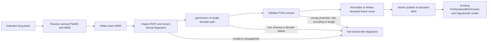

# Speaker Mode modern WEM decoding

Status: proposed design; no implementation or deployment is authorized by this document.

This design replaces Speaker Mode's legacy WEM decode chain so that Speaker
Mode can prepare audio from the same valid WEM that Rocksmith plays. Replacing a
new WEM with audio from an older package is a content workaround, not an engine
fix, and is explicitly excluded from the design.

## Problem statement

The current full-song preparation path inflates a WEM from the selected PSARC
and runs:

```text
ww2ogg -> revorb -> oggdec -> stereo PCM WAV
```

A DLC built with DLC Builder and Wwise 2023.1.19 played normally in Rocksmith,
but Speaker Mode preparation failed in `ww2ogg` with:

```text
Parse error: unknown chunk type
```

The observed boundary is therefore the external decoder, not the PSARC lookup,
chart tuning, pitch renderer, or Wwise playback-copy hook. The later package
which worked used the older WEM and does not prove that the Wwise 2023 WEM was
supported.

The exact failing Wwise 2023 WEM was overwritten during the workaround test. A
new copy must be generated and retained outside the repository before
implementation begins. No implementation may be accepted using only the older
WEM.

## Evidence and unknowns

### Observed

- Rocksmith accepted and played the Wwise 2023-generated package.
- Speaker Mode selected the correct chart target and reached audio preparation.
- `ww2ogg.exe` exited with code 1 on an unknown chunk.
- Replacing only the WEM with the older one allowed Speaker Mode to prepare and
  play the song.
- `SpeakerModeCacheExtractor` already skips bounded unknown RIFF chunks when it
  reads the Wwise frame count; the reported error came from `ww2ogg`.

### Supported by upstream documentation

- DLC Builder documents Wwise 2019, 2021, 2022 and 2023 support, and its release
  notes record Wwise 2023 support from DLC Builder 3.0.0 onward.
- vgmstream documents Wwise RIFF/WEM support and exposes a command-line decoder
  that writes WAV files.
- vgmstream's Wwise parser handles Wwise Vorbis configurations from multiple
  eras and ignores bounded extra chunks such as `akd ` instead of rejecting a
  WEM solely because the chunk is unfamiliar.

### Not yet proven

- The precise chunk which caused this particular WEM to fail.
- That a selected vgmstream release decodes the lost WEM bit-identically to
  Wwise. This cannot be tested until the WEM is regenerated.
- Which DLLs from the vgmstream Windows distribution are required by the exact
  pinned build. Packaging must be tested on a clean Windows machine.
- Support for Wwise versions after 2023. The design establishes an upgrade and
  qualification process; it does not claim unlimited future compatibility.

## Decision

Replace the entire Speaker Mode `ww2ogg`/`revorb`/`oggdec` path with one pinned
`vgmstream-cli` decoder path.

There will be no retry through the old decoder, no WEM substitution, and no
silent pass-through of unshifted music. A WEM either passes inspection, decoding,
PCM validation and exact-length normalization, or Speaker Mode disables itself
with an actionable error.

vgmstream is selected because its maintained Wwise parser is designed to
recognize several Wwise container and codec variants. The upstream format list
includes Wwise RIFF/WEM and Wwise custom Vorbis, while the parser explicitly
accounts for format changes over time and bounded extra chunks. This is a better
ownership boundary than extending an old OGG reconstruction tool one chunk at a
time.

The command-line integration is appropriate because extraction occurs in the
existing out-of-process preparation helper, before prepared PCM reaches the
real-time audio path. It does not add a process launch or codec operation to a
Wwise audio callback.

## Scope

The qualified support target is:

- Steam Rocksmith 2014 Remastered on Windows.
- Main-song WEMs that Rocksmith accepts from official content and DLC Builder.
- Legacy Rocksmith Wwise Vorbis plus DLC Builder output produced with Wwise
  2019, 2021, 2022 and 2023.
- Stereo 16-bit decoded PCM at 44.1 or 48 kHz, matching the existing native
  Speaker Mode contract.

Support is corpus-based. A Wwise version is supported only after its output has
passed the automated fixture tests and the in-game acceptance matrix. An unknown
future Wwise variant must fail with a format fingerprint and decoder version; it
must not be guessed at or handled by substituting different audio.

## Non-goals

- Encoding or repacking WEMs.
- Modifying DLC Builder or requiring authors to use an obsolete Wwise version.
- Changing preview pitch shifting, Signalsmith rendering, or the Wwise
  position-indexed PCM replacement hook.
- Supporting arbitrary vgmstream game formats merely because the decoder can
  read them.
- Retaining the legacy decoder as a fallback.
- Committing copyrighted Rocksmith song audio as a public test fixture.

## Architecture



The native `PreRenderedPitchCache` boundary remains unchanged. It continues to
receive a normalized WAV, render one continuous Signalsmith stream and provide
position-indexed prepared PCM to the original Wwise decoder.

### Components

| Component | Responsibility |
|---|---|
| `SpeakerModeCacheExtractor` | Parse the helper command, resolve the archive source, manage temporary files and publish only a validated result |
| `WemInspector` | Parse bounded RIFF chunks, capture the WEM format fingerprint and return the authoritative declared frame count |
| `IWemDecoder` | Define one decode operation from an inflated WEM to a temporary WAV |
| `VgmstreamWemDecoder` | Invoke the pinned vgmstream binary and translate process failures into structured diagnostics |
| `ExternalProcessRunner` | Quote arguments, capture both output streams concurrently, enforce cancellation/timeout and return exit data |
| `WavePcmValidator` | Validate PCM encoding, channels and sample rate, then normalize exactly to the WEM frame count |

These are top-level types in the `RSMods` namespace. Composition is explicit in
the command-line entry point; no service locator, runtime discovery or fallback
decoder is needed. Interfaces exist only at the process/decoder boundary where
unit tests require deterministic substitutes.

## WEM inspection contract

Before decoding, `WemInspector` must:

1. Require a bounded `RIFF`/`WAVE` container.
2. Walk chunks using each declared size plus RIFF word alignment.
3. Reject any chunk whose declared end exceeds the file length.
4. Read and record the format tag, channels, sample rate, `fmt ` size and Wwise
   declared frame count.
5. Record all chunk IDs and sizes for diagnostics.
6. Ignore a structurally valid unknown chunk rather than treating its name as a
   decode failure.
7. Reject zero frames, unsupported channels/rates, duplicate required chunks or
   malformed structure before launching the decoder.

The diagnostic fingerprint must not include audio payload bytes. A useful form
is:

```text
RIFF/WAVE codec=0xFFFF channels=2 rate=48000 frames=12345678
chunks=[fmt :66, akd :32, data:9876543]
```

The actual codec value and chunk list above are illustrative, not asserted facts
about the lost test file.

## Decoder contract

`IWemDecoder.Decode` receives:

- an absolute input WEM path;
- an absolute temporary output WAV path;
- a fixed decoder executable description containing version and SHA-256;
- a cancellation signal and deadline.

The vgmstream command is based on the upstream non-looping decode form:

```text
vgmstream-cli.exe -i -o <temporary.wav> <input.wem>
```

The exact flags must be locked by an integration test against the pinned binary,
not inferred from a different version's help text. `-i` prevents loop metadata
from extending a song. The output WAV is still treated as untrusted until
validated.

The decoder succeeds only when:

- the executable and required DLLs match the packaged manifest;
- the process exits with code 0 before the deadline;
- the output file exists and is non-empty;
- PCM validation and frame normalization succeed.

### Process lifetime

The native worker currently terminates `RSMods.exe` when preparation is cancelled.
A child decoder must not survive that termination. `ExternalProcessRunner` must
place `vgmstream-cli` in a Windows Job Object configured with
`JOB_OBJECT_LIMIT_KILL_ON_JOB_CLOSE`. The helper owns the only job handle, so
cancelling or killing the helper also ends the decoder.

Standard output and standard error must be drained concurrently. Reading one to
completion before the other risks deadlock when a child fills the other pipe.
The result records exit code, elapsed time, stdout and stderr. Timeout and
cancellation terminate the job and wait for confirmed process exit before
temporary files are removed.

## PCM validation and synchronization

The decoded WAV must be parsed as RIFF rather than assuming a fixed 44-byte
header. The validator must require:

- PCM format code 1;
- two channels;
- 16 bits per sample;
- a sample rate of 44,100 or 48,000 Hz;
- a complete `data` chunk aligned to a stereo frame;
- decoded frames greater than or equal to the Wwise declared frame count.

Codec tail padding is removed by truncating the data chunk to exactly:

```text
declared frames * 2 channels * 2 bytes
```

The RIFF and data sizes are then rewritten and reparsed. If the decoder produces
fewer frames, the operation fails; it must never synthesize silence to reach the
expected length. Exact frame count is the synchronization contract with the
native Wwise `positionStart` copy.

The completed WAV is published with an atomic same-volume rename only after all
checks pass. A failed or cancelled attempt cannot leave a partial file at the
path consumed by `PreRenderedPitchCache`.

## Diagnostics

Every extraction attempt must log or return:

- archive path and PSARC entry identifier;
- WEM byte length and SHA-256;
- WEM format fingerprint;
- decoder name, pinned version and executable SHA-256;
- command duration and exit code;
- bounded stdout/stderr on failure;
- decoded WAV format and raw frame count;
- declared frame count and number of trimmed tail frames;
- final outcome: published, cancelled, timed out or rejected.

Paths may be logged, but raw WEM/audio data must not be copied into the log. The
user-facing Speaker Mode failure remains concise and points to the full debug
record.

## Distribution and provenance

The decoder is packaged under a dedicated directory such as:

```text
RSMods/tools/speaker-mode/vgmstream/
```

The package contains:

- the pinned `vgmstream-cli.exe` release;
- the exact companion DLL set required by that release;
- upstream license text and third-party notices;
- a manifest containing upstream release URL, tag, commit when available,
  filename, size and SHA-256 for every binary.

vgmstream's top-level license permits redistribution with its copyright and
permission notice, but the binary's companion libraries have their own licenses.
Their notices and redistribution terms must be inventoried before the binary is
added to a release. A clean-machine test must prove that no developer-installed
codec, Wwise or PATH entry is required.

The old tools may remain in the general toolkit directory only if another
feature of `RocksmithToolkitLib` still requires them. Regardless of packaging,
Speaker Mode must have no code path to `ww2ogg`, `revorb`, `oggdec` or packed
codebooks after this replacement.

## Test corpus

### Repository-safe fixtures

Generate short, non-musical stereo signals owned by the project and encode them
with each supported Wwise toolchain. The fixtures should include impulses at
known frames as well as tones, because impulses expose start offset and length
errors more clearly than music.

Required variants:

- the legacy Wwise Vorbis layout used by existing official/CDLC content;
- Wwise 2019 DLC Builder output;
- Wwise 2021 DLC Builder output;
- Wwise 2022 DLC Builder output;
- Wwise 2023.1.19 DLC Builder output;
- a valid WEM containing a bounded extra chunk not understood by the local
  inspector;
- malformed RIFF length, truncated data, zero-frame and unsupported-format
  negative fixtures.

Before committing encoded synthetic fixtures, confirm that their Wwise SDK
licence permits redistribution. If it does not, CI generates them from available
SDKs or uses private CI artifacts; the public repository retains generators,
expected metadata and hashes rather than restricted binaries.

### Private real-song fixtures

Regenerate and preserve the exact Message of Love Wwise 2023 main WEM which
failed. Store it outside Git with:

- DLC Builder version;
- Wwise version;
- source audio hash;
- WEM hash and format fingerprint;
- generated PSARC hash.

Keep at least one legacy official or CDLC song as a regression fixture. These
files are for local/in-game qualification and must not be committed or published.

## Automated tests

### Unit tests

- RIFF traversal accepts bounded unknown chunks and word padding.
- RIFF traversal rejects truncated or overflowing chunks.
- Wwise frame count and format fingerprint are read correctly.
- WAV validation accepts only the native Speaker Mode PCM contract.
- Tail padding is trimmed to the exact declared frame count.
- Short decoder output fails instead of being padded.
- Atomic publication leaves no target on failure or cancellation.
- process output capture cannot deadlock and reports both streams.

### Decoder integration tests

For every qualified synthetic WEM:

1. Run the packaged decoder from a clean directory with an empty controlled
   `PATH`.
2. Assert exit code 0 and record the decoder identity.
3. Assert stereo PCM16 and the source sample rate.
4. Normalize to the declared Wwise frame count.
5. Assert exact final frame count and expected impulse positions.
6. Run twice and assert deterministic PCM bytes.

Negative tests assert the specific diagnostic category, no published WAV and no
orphan decoder process.

### Native/offline regression

Feed the decoded, normalized WAV through the existing Speaker Mode render
harness. Assert:

- exact total frame count;
- deterministic pitched PCM;
- no boundary discontinuities introduced by decode/publication;
- correct forward and backward position-indexed reads;
- no callback deadline regression.

## In-game acceptance matrix

Implementation is not complete until all rows have direct runtime evidence:

| Content | Required checks |
|---|---|
| Regenerated Message of Love using its Wwise 2023 WEM | preparation succeeds without substitution; Speaker Mode shifts; start and end remain synchronized; full playthrough |
| Same Wwise 2023 song | Riff Repeater forward seek, backward seek, restart and repeated section loop |
| Legacy official/CDLC song | preparation, preview, full song and Riff Repeater remain correct |
| Deliberately malformed fixture/package | clear decoder diagnostic and Speaker Mode visibly switches Off |
| Cancellation by changing/backing out of the song | helper and decoder both exit; no partial cache file or orphan process |

The log for the Wwise 2023 run must show the new decoder version, the exact WEM
hash, raw and declared frame counts and zero use of the legacy tool chain.

## Implementation sequence

1. Regenerate and preserve the exact failing Wwise 2023 WEM and PSARC.
2. Run a pinned vgmstream binary manually against that WEM and capture metadata,
   output format and frame counts. Stop if this proof fails; do not write an
   integration around an unproven decoder.
3. Confirm binary dependency and licence inventory on a clean Windows machine.
4. Add the WEM inspector, decoder abstraction, process runner and WAV validator.
5. Replace the current three-tool calls in `SpeakerModeCacheExtractor`; do not
   retain them as a fallback.
6. Add the synthetic compatibility corpus and automated tests.
7. Update GUI project and installer packaging with the pinned manifest/notices.
8. Build and run extractor, native/offline and clean-machine tests.
9. Perform the in-game acceptance matrix using the actual Wwise 2023 WEM.
10. Only after direct user confirmation, update release documentation and
    consider deployment. Commit, push and release remain separately authorized
    actions.

## Acceptance criteria

The decoder replacement is accepted only when:

- the regenerated Wwise 2023 WEM works without byte substitution or rebuilding
  with an older WEM;
- the supported-version synthetic corpus passes from the packaged binaries;
- a legacy song still passes;
- normalized PCM exactly matches Wwise's declared frame count;
- start, sustained playback, song end and Riff Repeater seeks stay synchronized;
- cancellation leaves no child process or partial cache artifact;
- unsupported/malformed input fails closed with the WEM fingerprint and pinned
  decoder identity;
- the Speaker Mode path contains no legacy decoder fallback;
- clean-machine packaging, licences and binary hashes are verified;
- an in-game test, not only a build or harness, confirms the result.

## Primary references

- [Existing RSModsPlus Speaker Mode design](speaker-mode.md)
- [DLC Builder supported Wwise versions](https://github.com/iminashi/Rocksmith2014.NET/blob/main/samples/DLCBuilder/README.md)
- [DLC Builder release notes](https://github.com/iminashi/Rocksmith2014.NET/blob/main/samples/DLCBuilder/RELEASE_NOTES.md)
- [vgmstream command-line usage](https://github.com/vgmstream/vgmstream/blob/master/doc/USAGE.md)
- [vgmstream Wwise format listing](https://github.com/vgmstream/vgmstream/blob/master/doc/FORMATS.md)
- [vgmstream Wwise parser](https://github.com/vgmstream/vgmstream/blob/master/src/meta/wwise.c)
- [vgmstream licence](https://github.com/vgmstream/vgmstream/blob/master/COPYING)
- [vgmstream releases](https://github.com/vgmstream/vgmstream/releases)
