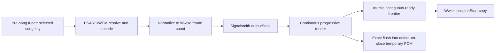

# Speaker Mode audio engine

Speaker Mode transposes Rocksmith's prerecorded music to the player's physical
guitar tuning. It is the inverse of Drop Pedal mode:

- Drop Pedal moves the live guitar from its physical tuning to the target tuning.
- Speaker Mode moves the authored song from the target tuning to the physical tuning.

The implementation is enabled in Debug and Release builds. Runtime investigation
details and the experiments that selected this insertion point are retained in
[speaker-mode-investigation.md](speaker-mode-investigation.md).

## Pitch model

Physical and target tunings are absolute semitone offsets from E standard:

```text
interval = target tuning - physical tuning
```

| Mode | Processed audio | Applied interval | Example |
|---|---|---:|---|
| Off | None | 0 | `Pitch: Off` |
| Drop Pedal | Live guitar | `interval` | `Drop: E -> Eb (-1)` |
| Speaker Mode | Streamed music | `-interval` | `Speaker: Eb -> E (+1)` |

Changing the physical tuning outside gameplay immediately changes the derived
interval. The comma/period controls choose the Drop Pedal and live-preview target
manually. Speaker Mode replaces that state with Rocksmith's selected chart tuning
in the pre-song tuner, so stale manual state cannot persist as a readout such as
F# while an Eb Standard chart is selected. Speaker Mode applies the inverse interval
to the song without inverting the displayed sign or colour. When the two tunings
match exactly, the overlay omits the arrow and interval.

## Insertion point

The engine hooks Audiokinetic's Wwise Vorbis registration, retains the distinct
file-source and bank-source identities, and hooks decoded output only for the
file-source decoder. It never hooks or modifies bank-decoder output.

This boundary was selected because it provides signed 16-bit decoded PCM before
Wwise mixes the voice, while preserving the factory distinction between streamed
music and bank-backed menu sound effects. Qualifying music is stereo, 44.1 or
48 kHz, and at least 20 seconds long. The same path covers song previews and
full songs.

Decoder addresses are reused, so each file-factory invocation starts a new
generation with independent processing state. Full-song identity does not depend
on undocumented pointers inside the factory context. The game already exposes
the selected song key through `GameState::GetSongKey()`; the preparation worker resolves that
key to `Song_<key>.bnk`, then matches the decoder by Wwise's sample rate and exact
declared frame count. Every other qualifying source stays on the live path. This
default-to-live rule is what keeps previews working if no prepared full song matches.

## Pitch processing

Previews use `StreamingPitchShifter`, which converts each interleaved stereo
block to float, processes it with vendored Signalsmith Stretch, then clips and
converts the result back to signed 16-bit PCM. `DelayLinePitchShifter` is
intentionally not reused: it is a low-latency monophonic processor for live
guitar, whereas prerecorded music is stereo polyphonic material.

Signalsmith is configured for two channels at the stream sample rate and receives
equal input and output frame counts. The decoder's frame count and playback
position are therefore unchanged, so processing does not accumulate additional
transport delay. Equal frame counts do not remove the processor's content
latency. Signalsmith's 120 ms default window reported 2,880 input frames plus
2,880 output frames at 48 kHz, or 120 ms total. That delay is independent of
Rocksmith's audio-buffer setting and became noticeable when playing against the
shifted song.

The preview configuration uses a 60 ms window and 15 ms interval. At 48 kHz it
reports 1,440 input frames plus 1,440 output frames. Preview timing is not used
for playing.

Full-song processing follows a separate path. The settings helper resolves the
selected bank to its owning PSARC and WEM and decodes it to temporary stereo PCM.
`oggdec` can expose codec tail padding, so the helper reads
Wwise's declared sample count from the WEM `fmt` extension and trims the decoded
WAV to that exact count. Prepared audio is rejected unless that count matches the Wwise
decoder.

The native worker runs one continuous Signalsmith state. `outputSeek` consumes
the start pre-roll, each later process call publishes the next contiguous range,
and `flush` supplies the exact tail. This preserves phase-vocoder history across
every boundary. The first ten seconds must be ready before a new Wwise file
source is constructed; the rest renders ahead of playback. When a forward seek
overtakes the render frontier, the Wwise audio worker waits for that exact range
instead of emitting muted, delayed, or wrong-pitch samples. Backward seeks and
normal playback are immediate. A preparation, streaming, or prepared-audio-copy failure
explicitly disables Speaker Mode and logs the error; it cannot remain visibly
enabled while passing through wrong-pitch decoder audio.



Song-list previews are always shifted live and do not start full-song preparation. Entering
the pre-song tuner waits for the tuning label to stabilize, validates that all
chart strings use a uniform offset, and requests the selected full-song render on
a background thread. Non-uniform and unresolved chart tunings fail closed rather
than rendering at a stale manual interval.
Selecting a different song cancels the extractor or renderer promptly. The file
factory waits only for the playable opening, not for the whole song.

During playback, the original decoder still advances normally; each returned
block is overwritten from prepared PCM at the decoder's reported `positionStart`.
The ready path performs bounds checks and a small copy, with no pitch DSP or
content delay. Pitch, physical-tuning, and mode controls are
locked for the duration of gameplay because a new high-quality render takes
several seconds and cannot be changed immediately without adding DSP latency.

## Detection and live tone

Speaker Mode leaves the live input and rendered guitar tone unshifted. Rocksmith's
tuning reference is adjusted by the inverse interval so its expected notes remain
consistent with the physical guitar. The original isolation test established that
preview and full-song streams were selected without muting menu SFX; it did not
separately prove live guitar tone or note detection.

## Verified behavior

| Check | Result |
|---|---|
| File and bank factory identity | Distinct and retained |
| Preview isolation | Preview music muted by the isolation probe |
| Full-song isolation | Full-song music muted by the isolation probe |
| Menu SFX isolation | Unaffected by the isolation probe |
| Signed 16-bit layout | Confirmed after the incorrect float interpretation produced static |
| Gain probe | Music level reduced cleanly, without static |
| Polyphonic pitch | Preview and full-song music shifted cleanly |
| Original 120 ms window | Pitch worked, but playing exposed noticeable latency |
| Low-latency stream benchmark | 60 ms fixed DSP latency at approximately 1-2% of one CPU core |
| Full-song decode frame count | Thin Boys: `12,129,984` raw decoder frames normalized to Wwise's `12,129,454` |
| Packaged helper extraction | Thin Boys decoded and normalized in 2.1-4.1 seconds across final runs; every new preparation decodes again |
| Progressive opening | First ten seconds rendered in 12 ms in the explicit x86 benchmark |
| Progressive full render | 9.664 seconds for 4:35 in x86; deterministic output with all `12,129,454` positions |
| Progressive call boundaries | Boundary RMS delta 0.0367 versus 0.0376 globally; no boundary spike |
| Full-song playback path | Position-indexed memory copy; no streaming DSP latency |
| Offline start/end compensation | Current Signalsmith `outputSeek` plus exact-length flush |
| Independent segment rendering | Rejected: 8 x86 workers took 1.906 seconds but hard seams differed by up to 1.82 full-scale |
| Extraction/decode stages | 59/5/780/93/936 ms for resolve/inflate/ww2ogg/revorb/oggdec |
| Gameplay pitch stability | Pitch and mode controls are locked until gameplay ends |

## Known scope

- Steam Rocksmith 2014 Remastered's observed 32-bit Wwise layout.
- Stereo streamed Vorbis music at 44.1 or 48 kHz.
- Integer semitone shifts in the shared -24 to +24 target range.
- Speaker Mode changes the mixed song, not individual stems.
- Exact recorded-output correlation, unusual custom asset formats, multiplayer,
  and extended in-game Riff Repeater stress sessions have not been separately validated.
- The progressive implementation has passed the standalone x86 build and
  data-path benchmarks but has not been deployed for a new in-game test yet.

## Source layout

| File | Responsibility |
|---|---|
| `WwiseMusicHook.cpp/.hpp` | Codec/factory hook, song-key selection, preview/full routing, position-indexed playback |
| `PreRenderedPitchCache.cpp/.hpp` | Cancellation, continuous progressive render, ready frontier, bounded temporary PCM lifecycle |
| `StreamingPitchShifter.cpp/.hpp` | Preview-only block processing |
| `ThirdParty/SignalsmithStretch/` | Vendored current Signalsmith Stretch and provenance |
| `GUI/SpeakerModeCacheExtractor.cs` | PSARC/bank/WEM resolution and Wwise Vorbis decode command |
| `Mods/DropPedal.cpp/.hpp` | Mode state, physical/target tuning model, note-reference control |
